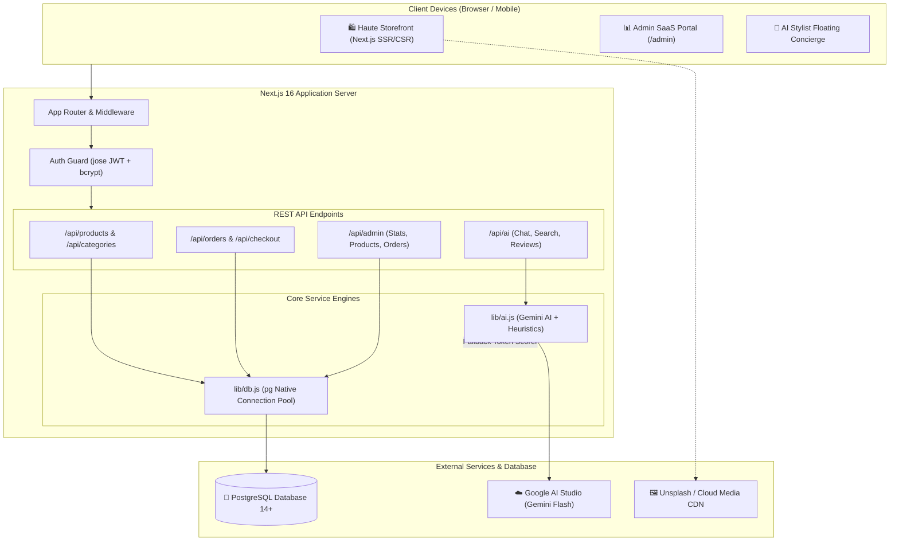
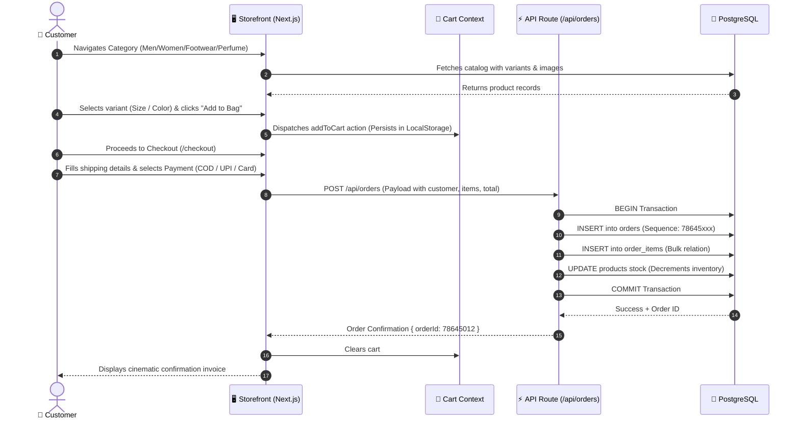
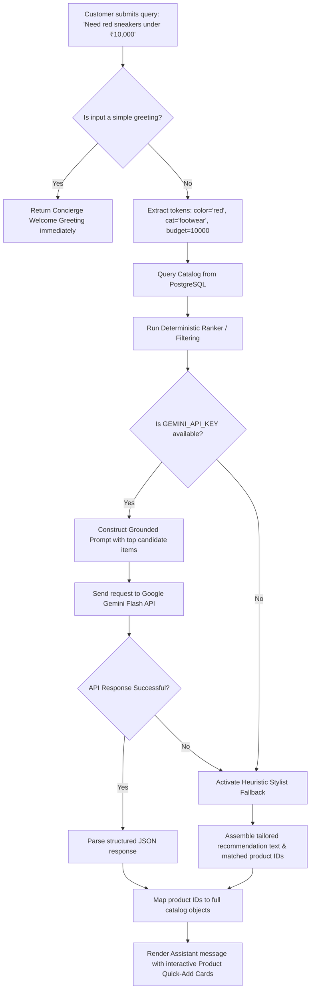
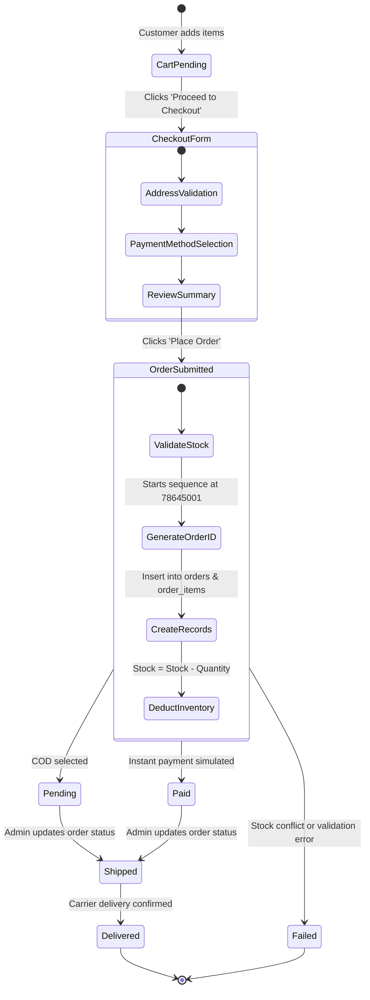
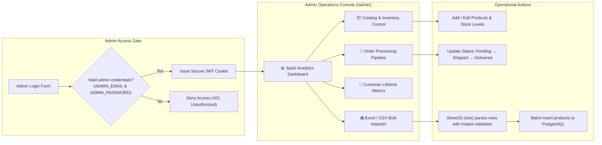
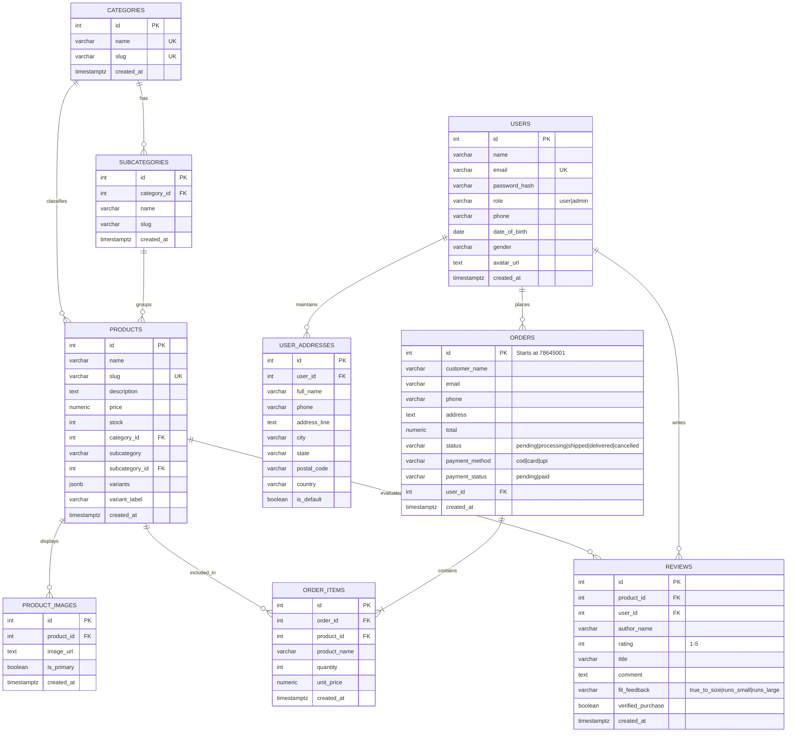

# 🏛️ PrimeNest Luxury E-Commerce & Administrative SaaS Suite

<div align="center">


### *Haute Couture • Bespoke Fashion • Generative AI Stylist • Administrative SaaS Suite*

---

[](https://nextjs.org/)
[](https://react.dev/)
[](https://www.typescriptlang.org/)
[](https://developer.mozilla.org/)
[](https://www.postgresql.org/)
[](https://aistudio.google.com/)
[](https://tailwindcss.com/)
[](LICENSE)

</div>

---

## 📑 Table of Contents

1. [Executive Overview](#-executive-overview)
2. [Languages, Frameworks & Core Technologies](#-languages-frameworks--core-technologies)
3. [AI Models & Generative Intelligence](#-ai-models--generative-intelligence)
4. [CSS Architecture & Styling Philosophy](#-css-architecture--styling-philosophy)
5. [Computer Science Principles & Architecture](#-computer-science-principles--architecture)
6. [System Architecture & Visual Flow Charts](#-system-architecture--visual-flow-charts)
   - [High-Level Architecture](#1-high-level-system-architecture)
   - [Customer Storefront Journey](#2-customer-storefront--shopping-flow)
   - [AI Stylist & Semantic Search Pipeline](#3-ai-concierge--semantic-pipeline-flow)
   - [Order & Checkout Transaction Lifecycle](#4-order-placement--payment-lifecycle)
   - [Administrative SaaS Control Flow](#5-administrative-saas-operational-flow)
   - [Database Entity-Relationship (ER) Diagram](#6-database-entity-relationship-er-diagram)
7. [Repository File & Directory Structure](#-repository-file--directory-structure)
8. [Database Schema & Data Model](#-database-schema--data-model)
9. [RESTful API Endpoints Specification](#-restful-api-endpoints-specification)
10. [Local Installation & Development Setup](#-local-installation--development-setup)
11. [Environment Variables Configuration](#-environment-variables-configuration)
12. [NPM Scripts & Automation Tooling](#-npm-scripts--automation-tooling)
13. [Troubleshooting & FAQs](#-troubleshooting--faqs)
14. [Contributing & Author](#-contributing--author)

---

## 🌟 Executive Overview

**PrimeNest** is an enterprise-grade luxury e-commerce web platform and centralized Administrative SaaS dashboard designed to deliver the digital equivalent of a private Mayfair or Fifth Avenue boutique. 

Blending high-fashion editorial aesthetics with modern web engineering, PrimeNest incorporates:
- **Haute Couture Storefront**: Curated catalog covering Men, Women, Footwear, Perfumery, and Accessories with rich editorial carousels and cinematic photography.
- **Google Gemini Generative AI**: An interactive, natural-language personal shopping stylist and catalog-grounded concierge (`Prime Stylist`), automated customer review summarization, and semantic search.
- **Admin SaaS Operations Engine**: Complete inventory control, live revenue graphs, sales trends, customer lifetime metrics, dynamic product editors, and Excel/CSV batch import tooling.
- **Robust Security & Data Pipeline**: Relational PostgreSQL database with connection pooling, JWT-based cryptographic sessions with `jose`, and `bcryptjs` password encryption.

---

## 💻 Languages, Frameworks & Core Technologies

PrimeNest is engineered using modern web standards across frontend, backend, database, and machine intelligence layers:

### 1. Programming & Scripting Languages

| Language | Version / Standard | Application Scope |
| :--- | :--- | :--- |
| **JavaScript** | ECMAScript 2024 (ESM `.mjs` & Next.js JSX) | Core application business logic, React components, client hooks, server actions, and administrative views. |
| **TypeScript** | `v5.x` (`tsconfig.json`, `next-env.d.ts`) | Type definitions, contract enforcement, and developer safety in Next.js configurations and root layout. |
| **SQL** | PostgreSQL Dialect (`14+`, `15.x`, `17+`) | Relational table definitions, primary/foreign key constraints, sequences, triggers, JSONB queries, and high-performance b-tree indexes. |
| **CSS** | CSS3 / W3C Modern CSS Spec | Custom luxury design tokens, CSS variables, keyframe animations, glassmorphism filters, and editorial print styling. |
| **HTML** | HTML5 Semantic Living Standard | Semantic document structures (`<header>`, `<main>`, `<nav>`, `<section>`, `<footer>`, `<dialog>`), accessibility attributes, and SEO metadata. |
| **JSON** | RFC 8259 | Data exchange format for REST APIs, database JSONB product variants, and internationalization configuration. |
| **Markdown** | CommonMark / GitHub Flavored Markdown (GFM) | Project documentation, agent guidelines, and setup instructions. |

### 2. Core Frameworks & Runtime Libraries

- **Next.js 16.3.6 (App Router)**: Hybrid Server-Side Rendering (SSR), Static Site Generation (SSG), Client Components (`"use client"`), and API Routes (`route.js`).
- **React 19.2.8 & React DOM 19**: Concurrent rendering engine, state hooks, and component lifecycle management.
- **Node.js (Runtime)**: High-performance asynchronous V8 runtime powering server-side API execution and migration scripts.
- **PostgreSQL Client (`pg` v8.23.0)**: Native connection pooling via `pg.Pool` for high-throughput queries with parameterized SQL injection defense.
- **Prisma Client (`@prisma/client` / `prisma` v8)**: Available ORM abstraction layer for typed database queries and schema definitions.
- **Jose (`v6.2.12`)**: Web Cryptography API-compliant JSON Web Token (JWT) signing, verification, and encrypted HTTP-only session cookies.
- **Bcryptjs (`v3.0.3`)**: One-way salt-hashed password protection.
- **Lucide React (`v1.48.0`)**: Comprehensive feather-weight SVG icon system.
- **Sonner (`v2.0.8`)**: Non-blocking toast notification system.
- **SheetJS (`xlsx` v0.18.5)**: Client/Server parsing engine for Excel (`.xlsx`, `.xls`) and CSV product catalog batch imports.

---

## 🧠 AI Models & Generative Intelligence

PrimeNest utilizes state-of-the-art Generative AI models combined with catalog-grounded fallback heuristics to deliver personalized luxury shopping assistance.

```
┌────────────────────────────────────────────────────────────────────────┐
│                        PRIMENEST AI ECOSYSTEM                          │
├────────────────────────────────────────────────────────────────────────┤
│  1. Google Gemini Flash (gemini-3-flash-preview / gemini-1.5-flash)     │
│     ├─ Conversational Concierge & Fashion Stylist                     │
│     ├─ Natural Language Intent & Semantic Search Ranking               │
│     └─ Customer Review Aggregation & Sentiment Breakdown               │
│                                                                        │
│  2. Computer Vision & Inpainting (Extensible Architecture)             │
│     ├─ OpenAI DALL·E 3 / GPT-4o Neural Inpainting Framework             │
│     ├─ IDM-VTON 2.0 Diffusion Engine (Replicate API)                   │
│     └─ Gemini Vision Garment & Silhouette Drape Analysis               │
│                                                                        │
│  3. Intelligent Deterministic Fallback Engine                          │
│     └─ Zero-Downtime Rule-Based Scoring when API Keys are absent       │
└────────────────────────────────────────────────────────────────────────┘
```

### Detailed AI Model Breakdown

#### 1. Primary AI Engine: Google Gemini Flash
- **SDK**: `@google/generative-ai` (`v0.24.1`)
- **Default Model Identifier**: `gemini-3-flash-preview` / `gemini-1.5-flash`
- **Temperature & Output Handling**: Low temperature (0.2–0.4) with strictly formatted JSON outputs (`application/json`) stripped of markdown fences to prevent parsing anomalies.
- **Features Powered**:
  1. **PrimeNest Personal Stylist (`getStylistResponse`)**:
     - Acts as an elite boutique concierge.
     - Enforces strict catalog grounding: Only recommends items genuinely present in the inventory with exact stock IDs, prices, and colorways.
     - Gracefully handles greetings, occasion dress codes (black tie, summer linen, dinner dates), and color palette queries.
  2. **Semantic Search & Intent Parser (`runSemanticSearch`)**:
     - Converts free-form natural language (e.g. *"lightweight breathable attire for tropical dinner"*) into structured criteria (seasonality, occasion, color, cut).
     - Ranks catalog products with individual **Match Scores (75%–99%)** and punchy, human-readable **Match Reasons**.
  3. **AI Customer Review Summarizer (`summarizeReviews`)**:
     - Analyzes customer feedback corpus for any given product.
     - Produces a concise 2-sentence **Verdict**, 3 **Pros**, 1–2 **Cons**, sentiment grading, and a **True-to-Size fit meter**.

#### 2. Virtual Try-On & Vision Architecture (Extensible Engine in `lib/ai.js`)
- **OpenAI DALL·E 3 / GPT-4o Inpainting**: Neural transfer prompt protocol designed to drape target garments onto uploaded user portraits while preserving facial identity, posture, and lighting.
- **IDM-VTON 2.0 (Identity-Preserving Virtual Try-On)**: Diffusion model integration via Replicate for garment warping and photorealistic synthesis.
- **Gemini Vision**: Visual validation engine assessing fit, drape, silhouette balance, and styling recommendations.

#### 3. Deterministic Heuristic Fallback Engine
To ensure high availability, every AI endpoint includes an offline algorithmic fallback:
- Weighted token analyzer across product names, categories, tags, and material descriptions.
- Color dictionaries (`COLOR_MAP`) with synonyms (e.g., *Phantom* / *Noir* -> Black; *Ivory* / *Pearl* -> White; *Crimson* / *Ruby* -> Red).
- Category penalty matrix (e.g., prevents showing slides when sneakers are requested).

---

## 🎨 CSS Architecture & Styling Philosophy

PrimeNest rejects generic flat aesthetics in favor of **Haute Horlogerie & Fashion Editorial Styling**. The styling architecture is a hybrid implementation:

### 1. Classification of CSS Used

```
┌─────────────────────────────────────────────────────────────────────────┐
│                          CSS ARCHITECTURE                               │
├────────────────────────────────┬────────────────────────────────────────┤
│ TYPE OF CSS                    │ IMPLEMENTATION LOCATION                │
├────────────────────────────────┼────────────────────────────────────────┤
│ 1. Curated Vanilla CSS         │ app/globals.css (320KB+ bespoke tokens)│
│ 2. Scoped Page Stylesheets     │ app/editorial.css                      │
│                                │ app/product-dark.css                   │
│                                │ app/login/login-luxury.css             │
│ 3. Component-Level CSS         │ components/NavbarLuxury.css            │
│                                │ components/ProductShowcase.css         │
│ 4. Tailwind CSS (v3 / v4)      │ tailwind.config.js & @tailwindcss/     │
│                                │ postcss for utility layouts            │
│ 5. Glassmorphism & Micro-FX    │ backdrop-filter, ambient glow, blurs   │
└────────────────────────────────┴────────────────────────────────────────┘
```

### 2. Styling Tokens & Custom Properties

```css
:root {
  /* Chromatic Palette */
  --background: #ffffff;
  --foreground: #111111;
  --primary: #111111;
  --accent: #c9a227;          /* Bespoke Metallic Champagne Gold */
  --muted: #6b7280;
  --border: #e5e5e5;
  --obsidian-dark: #0a0a0c;   /* Haute Dark Canvas */
  --gold-glow: rgba(201, 162, 39, 0.25);

  /* Curated Typography Scale */
  --font-playfair: 'Playfair Display', Georgia, serif;
  --font-cormorant: 'Cormorant Garamond', Georgia, serif;
  --font-jakarta: 'Plus Jakarta Sans', -apple-system, sans-serif;
  --font-inter: 'Inter', -apple-system, sans-serif;
}
```

### 3. Typography Mastery
- **Editorial Headings**: *Playfair Display* with tight negative letter-spacing (`-0.02em`) creates dramatic title contrast.
- **Haute Accents & Italics**: *Cormorant Garamond* italics add European editorial flair to product subtitles and luxury callouts.
- **Interface & Metrics**: *Plus Jakarta Sans* and *Inter* for crisp numeric legibility and button controls.
- **Admin System UI Immunity**: Dedicated CSS rules isolate the `/admin` console with `-apple-system, BlinkMacSystemFont, "Segoe UI", Roboto` to prevent serif fonts from disturbing data grids.

### 4. Visual Signatures
- **Glassmorphic Surface Design**: Translucent elements with `backdrop-filter: blur(16px)` and delicate borders (`rgba(255, 255, 255, 0.08)`).
- **Ambient Gold Illumination**: Radial background gradients creating soft warm spotlighting behind flagship products.
- **Micro-Interactions**: Smooth cubic-bezier transitions (`transition: all 0.4s cubic-bezier(0.16, 1, 0.3, 1)`), hover zoom on product cards, and floating drawer animations.

---

## 🏛️ Computer Science Principles & Architecture

PrimeNest adheres to robust Computer Science and Software Engineering design principles:

1. **Separation of Concerns (SoC)**:
   - **Presentation Layer**: Client React components (`components/*.jsx`).
   - **Business & AI Layer**: Server-side logic, AI prompt templates, and ranking algorithms (`lib/ai.js`).
   - **Data Access Layer**: Database queries, connection pooling, and parameterized SQL statements (`lib/db.js`).
2. **Stateless Authentication with Asymmetric Cryptography**:
   - Secure stateless authentication using JSON Web Tokens (JWT) signed with HMAC-SHA256 via `jose`.
   - Stored in HTTP-only, SameSite, Secure cookies, mitigating Cross-Site Scripting (XSS) and CSRF vectors.
3. **Database Normalization & B-Tree Indexing**:
   - 3rd Normal Form (3NF) relational database schema for orders, categories, users, reviews, and addresses.
   - B-Tree indexes on query hot-paths: `LOWER(email)`, `category_id`, `subcategory_id`, `slug`, `created_at DESC`.
   - Hybrid JSONB storage for variant matrices (`[{"label": "UK 9", "stock": 5}]`) combining relational integrity with NoSQL flexibility.
4. **Resilient AI Graceful Degradation (Circuit-Breaker Pattern)**:
   - External API calls to Google Gemini are wrapped in timeout-guarded exception handlers.
   - In cases of API rate-limiting or absent credentials, the engine instantly degrades to local lexical and intent heuristics without throwing 500 errors to the customer.
5. **Optimistic UI Updates & Client Contexts**:
   - `CartContext` and `WishlistContext` implement optimistic local storage synchronization with immediate feedback for add-to-cart operations.

---

## 📊 System Architecture & Visual Flow Charts

### 1. High-Level System Architecture



---

### 2. Customer Storefront & Shopping Flow



---

### 3. AI Concierge & Semantic Pipeline Flow



---

### 4. Order Placement & Payment Lifecycle



---

### 5. Administrative SaaS Operational Flow



---

### 6. Database Entity-Relationship (ER) Diagram



---

## 📁 Repository File & Directory Structure

```text
primenest-e-commerce/
├── app/                                    # Next.js 16 App Router Directory
│   ├── about/                              # Brand ethos & luxury heritage page
│   ├── accessories/                        # Curated luxury accessories catalog
│   ├── admin/                              # Administrative SaaS Suite
│   │   ├── analytics/                      # Deep-dive sales and revenue graphs
│   │   ├── customers/                      # Customer lifetime and spend registry
│   │   ├── login/                          # Admin authentication gateway
│   │   ├── orders/                         # Live order management and status updater
│   │   ├── products/                       # Inventory editing and stock management
│   │   ├── settings/                       # Admin preferences and configuration
│   │   ├── layout.jsx                      # Isolated Admin layout with system typography
│   │   └── page.jsx                        # Main SaaS analytics dashboard overview
│   ├── api/                                # REST API Route Handlers
│   │   ├── admin/                          # Admin metrics, orders, products, customers
│   │   ├── ai/                             # AI Chat, Search, Review Summarizer, Try-On
│   │   ├── auth/                           # Login, Register, Logout, Me, Session verification
│   │   ├── categories/                     # Catalog taxonomy API
│   │   ├── contact/                        # Concierge inquiry form submissions
│   │   ├── orders/                         # Order creation and order tracking
│   │   ├── products/                       # Dynamic product querying and filters
│   │   ├── profile/                        # Customer profile and address management
│   │   ├── proxy-image/                    # High-performance image proxy
│   │   ├── reviews/                        # Product reviews CRUD and ratings
│   │   └── subcategories/                  # Subcategory taxonomy API
│   ├── beauty/                             # High-end cosmetic and beauty catalog
│   ├── cart/                               # Interactive shopping bag page
│   ├── checkout/                           # Multi-step checkout & payment processing
│   ├── contact/                            # Customer care and VIP concierge desk
│   ├── editorial.css                       # Scoped CSS for high-fashion editorial layouts
│   ├── faq/                                # Frequently Asked Questions & policies
│   ├── footwear/                           # Sneakers, formal shoes & slides collection
│   ├── globals.css                         # Master design system (320KB+ custom CSS)
│   ├── home/                               # Alternate homepage components
│   ├── journal/                            # High-fashion editorial journal / blog
│   ├── kids/                               # Children's luxury apparel
│   ├── layout.tsx                          # Root Next.js layout (Google Fonts & Contexts)
│   ├── login/                              # Customer glassmorphic login interface
│   │   └── login-luxury.css                # Bespoke login styling with ambient lighting
│   ├── men/                                # Men's tailored apparel catalog
│   ├── page.tsx                            # Flagship luxury storefront landing page
│   ├── perfume/                            # Haute perfumerie and fragrance boutique
│   ├── privacy/                            # Privacy policy and GDPR compliance
│   ├── product/                            # Product detail dynamic routes ([id], [slug])
│   ├── product-dark.css                    # Dark-mode product showcase styling
│   ├── profile/                            # Customer account dashboard & order history
│   ├── register/                           # Customer membership registration
│   ├── search/                             # AI-powered semantic search page
│   ├── shipping/                           # Shipping speed and delivery information
│   ├── shipping-returns/                   # Return policies and concierge exchanges
│   ├── shop/                               # Comprehensive catalog overview
│   ├── terms/                              # Terms of service
│   ├── wishlist/                           # Saved luxury pieces interface
│   └── women/                              # Women's ready-to-wear and couture catalog
├── components/                             # Reusable React UI Components
│   ├── admin/                              # Admin-specific UI components
│   │   └── ProductImportModal.jsx          # Excel (.xlsx) / CSV batch product importer
│   ├── AIReviewSummarizer.jsx              # AI Customer review breakdown with fit meter
│   ├── AIShoppingAssistant.jsx             # Floating 'Prime Stylist' concierge drawer
│   ├── CategoryShowcase.jsx                # Visual grid for primary shopping categories
│   ├── EditorialBanner.jsx                 # Magazine-style editorial image banner
│   ├── Footer.jsx                          # Comprehensive site footer with newsletter
│   ├── Hero.jsx                            # Cinematic video/image homepage hero
│   ├── Navbar.jsx                          # Glassmorphic header with search and bag drawer
│   ├── NavbarLuxury.css                    # Scoped styles for navigation and dropdowns
│   ├── ProductShowcase.css                 # Scoped styles for product display cards
│   ├── ProductShowcase.jsx                 # Interactive product carousel & quick-add
│   └── VirtualTryOnModal.jsx               # Computer-vision virtual try-on module
├── context/                                # React Context Providers (State Management)
│   ├── CartContext.jsx                     # Shopping bag items, quantities, totals & local sync
│   └── WishlistContext.jsx                 # Saved customer items state management
├── lib/                                    # Core Utilities & Backend Services
│   ├── ai.js                               # Google Gemini model init, semantic search, stylist
│   ├── auth.js                             # Jose JWT cookie helpers & token verification
│   └── db.js                               # PostgreSQL connection pool (pg.Pool singleton)
├── public/                                 # Static Assets (Images, Icons, Fonts)
├── scripts/                                # Database Setup & Seeding Automation
│   ├── remove-categories.mjs               # Category cleanup utility
│   ├── remove-kurtis.mjs                   # Inventory curation script
│   ├── remove-sweaters-suits-leggings.mjs  # Catalog filtering script
│   ├── seed-analytics-orders.mjs           # Populates historical orders for admin graphs
│   ├── seed-luxury-customers.mjs           # Seeds VIP customer profiles & addresses
│   ├── seed-rich-catalog.mjs               # Seeds 340+ luxury products across categories
│   ├── seed-subcategories.mjs              # Seeds granular subcategories
│   ├── seed-users-with-orders.mjs          # Seeds demo users with linked order histories
│   ├── setup-ai-tables.mjs                 # Creates tables for AI review summarizer
│   ├── setup-db.mjs                        # Creates primenest_db & executes schema.sql
│   └── update-variants.mjs                 # Enriches variant matrices for existing products
├── .env.example                            # Sample environment variables template
├── package.json                            # Project dependencies and script declarations
├── postcss.config.js                       # PostCSS plugins configuration
├── schema.sql                              # Complete PostgreSQL DDL schema & sample dataset
├── tailwind.config.js                      # Tailwind CSS customization & theme tokens
└── tsconfig.json                           # TypeScript compiler configuration
```

---

## 🗄️ Database Schema & Data Model

The PostgreSQL database `primenest_db` is designed with relational integrity, constraints, cascades, and sequence customizations:

| Table Name | Primary Purpose | Key Columns & Constraints |
| :--- | :--- | :--- |
| **`categories`** | Top-level catalog classifications | `id` (PK), `name` (Unique), `slug` (Unique). |
| **`subcategories`** | Fine-grained category taxonomies | `id` (PK), `category_id` (FK → categories), `name`, `slug`, `UQ(category_id, name)`. |
| **`products`** | Central product catalog registry | `id` (PK), `name`, `slug` (Unique), `description`, `price` (Check >= 0), `stock` (Check >= 0), `category_id` (FK), `subcategory_id` (FK), `variants` (JSONB), `variant_label`. |
| **`product_images`** | One-to-many product photography | `id` (PK), `product_id` (FK → products ON DELETE CASCADE), `image_url`, `is_primary` (Boolean). |
| **`users`** | Customer & Administrator accounts | `id` (PK), `name`, `email` (Unique), `password_hash`, `role` (`user` \| `admin`), `phone`, `date_of_birth`, `gender`, `avatar_url`. |
| **`user_addresses`** | Customer saved shipping destinations | `id` (PK), `user_id` (FK → users ON DELETE CASCADE), `address_line`, `city`, `state`, `postal_code`, `is_default`. |
| **`orders`** | Customer purchase orders | `id` (PK, Starts at `78645001`), `customer_name`, `email`, `phone`, `address`, `total`, `status` (`pending`, `processing`, `shipped`, `delivered`, `cancelled`), `payment_method`, `payment_status`. |
| **`order_items`** | Line-item breakdowns for orders | `id` (PK), `order_id` (FK → orders ON DELETE CASCADE), `product_id` (FK), `product_name`, `quantity`, `unit_price`. |
| **`reviews`** | Customer ratings & AI inputs | `id` (PK), `product_id` (FK → products ON DELETE CASCADE), `user_id` (FK), `author_name`, `rating` (1–5), `title`, `comment`, `fit_feedback`, `verified_purchase`. |

---

## 🔌 RESTful API Endpoints Specification

### 1. Storefront & Catalog
- `GET /api/products`: Query products with pagination, category filtering, subcategory sorting, and search terms.
- `GET /api/products/[id]`: Retrieve single product with images, variants, and related items.
- `GET /api/categories`: Retrieve all root categories and active subcategories.
- `GET /api/subcategories`: Fetch subcategories filtered by category ID.

### 2. AI Intelligence Suite
- `POST /api/ai/chat`: Interactive chat with Prime Stylist. Accepts `{ message, history }`, returns `{ reply, products }`.
- `GET /api/ai/search?q={query}`: Natural-language semantic search returning ranked items with match explanations.
- `GET /api/ai/review-summary?productId={id}`: Generates AI consensus verdict, pros/cons list, and fit breakdown.
- `POST /api/ai/try-on`: Virtual try-on pipeline endpoint.

### 3. Orders & Checkout
- `POST /api/orders`: Place a new order with items payload, shipping address, and payment method.
- `GET /api/orders?email={email}`: Retrieve historical orders for a given customer email.

### 4. Authentication & Customer Profiles
- `POST /api/auth/register`: Create customer account with encrypted password.
- `POST /api/auth/login`: Authenticate credentials, set HTTP-only JWT session cookie.
- `POST /api/auth/logout`: Invalidate session cookie.
- `GET /api/auth/me`: Verify session and retrieve current logged-in user profile.
- `GET / POST /api/profile`: Manage user addresses, telephone, and personal information.

### 5. Administrative SaaS Endpoints (`/api/admin/*`)
- `GET /api/admin/stats`: Total revenue, order count, customer registrations, and inventory low-stock alerts.
- `GET /api/admin/orders`: Full administrative orders table with status filter and pagination.
- `PATCH /api/admin/orders`: Update order status (`pending` → `shipped` → `delivered`).
- `GET / POST / PUT / DELETE /api/admin/products`: Full CRUD operations on inventory catalog.
- `POST /api/admin/products/import`: Batch import products from parsed Excel or CSV files.
- `GET /api/admin/customers`: Customer registry with order frequency and total lifetime spend.

---

## 🚀 Local Installation & Development Setup

Follow these steps to run the complete PrimeNest platform on your local workstation:

### Prerequisites
- **Node.js**: `v18.17.0` or higher (`v20.x` LTS recommended)
- **npm**: `v9.x` or higher
- **PostgreSQL**: `v14+` running locally on port `5432`
- **Git**: Installed and configured

### Step 1: Clone Repository & Install Dependencies
```bash
git clone https://github.com/Rudra-Navadiya/PrimeNest-E-Commerce.git
cd Primenest-E-Commerce
npm install
```

### Step 2: Configure Environment Variables
Copy the template configuration file:
```bash
# On Linux / macOS / Git Bash:
cp .env.example .env

# On Windows PowerShell:
Copy-Item .env.example .env
```

Open `.env` in your code editor and provide your local PostgreSQL credentials:
```env
DB_USER=postgres
DB_HOST=localhost
DB_PORT=5432
DB_NAME=primenest_db
DB_PASSWORD=your_actual_postgres_password
```

### Step 3: Initialize Database in One Step
Run the comprehensive initialization script:
```bash
npm run db:init
```

> **What `npm run db:init` does automatically:**
> 1. Connects to PostgreSQL and creates the database `primenest_db` if it doesn't already exist.
> 2. Applies the full relational schema, tables, foreign keys, and indexes from `schema.sql`.
> 3. Seeds the catalog with 340+ luxury products across all categories (`seed-rich-catalog.mjs`).
> 4. Populates historical orders, customers, and financial records for the Admin SaaS charts (`seed-analytics-orders.mjs`).

### Step 4: Launch Development Server
```bash
npm run dev
```

The Next.js server will start on port **`3001`**:
- 🛍️ **Luxury Storefront**: [http://localhost:3001](http://localhost:3001)
- 📊 **Administrative SaaS Portal**: [http://localhost:3001/admin](http://localhost:3001/admin)
- 🛒 **Cart & Checkout**: [http://localhost:3001/cart](http://localhost:3001/cart)
- 🔍 **AI Semantic Search**: [http://localhost:3001/search](http://localhost:3001/search)

---

## 🔐 Environment Variables Configuration

Here is the complete reference of all supported environment variables:

| Variable | Required? | Default / Example | Description |
| :--- | :---: | :--- | :--- |
| `DB_USER` | **Yes** | `postgres` | PostgreSQL database username. |
| `DB_HOST` | **Yes** | `localhost` | PostgreSQL host server address. |
| `DB_PORT` | **Yes** | `5432` | PostgreSQL port number. |
| `DB_NAME` | **Yes** | `primenest_db` | Target PostgreSQL database name. |
| `DB_PASSWORD` | **Yes** | `admin` | Password for PostgreSQL user. |
| `ADMIN_SESSION_SECRET`| **Yes** | *(32+ char secret string)* | Cryptographic key for signing admin JWT sessions. |
| `ADMIN_EMAIL` | **Yes** | `admin@primenest.com` | Default email for accessing `/admin`. |
| `ADMIN_PASSWORD` | **Yes** | `admin123` | Default password for accessing `/admin`. |
| `GEMINI_API_KEY` | Optional | `AIzaSy...` | Google Gemini API Key from [AI Studio](https://aistudio.google.com/). Activates live LLM features. |
| `REPLICATE_API_TOKEN` | Optional | `r8_...` | API token for Replicate IDM-VTON virtual try-on. |
| `OPENAI_API_KEY` | Optional | `sk-...` | API key for OpenAI DALL·E 3 inpainting models. |

---

## ⚡ NPM Scripts & Automation Tooling

| Script Command | Shell Invocation | Operational Purpose |
| :--- | :--- | :--- |
| `npm run dev` | `next dev -p 3001` | Starts the Next.js development server with hot module replacement on port 3001. |
| `npm run build` | `next build` | Compiles and optimizes production assets, routes, and bundles. |
| `npm run start` | `next start` | Starts the production server using the compiled `.next` distribution. |
| `npm run lint` | `eslint` | Executes ESLint static code analysis across all files. |
| `npm run db:init` | `node scripts/setup-db.mjs && ...` | **All-in-one setup**: Creates database, applies DDL schema, and seeds catalog and analytics. |
| `npm run db:setup` | `node scripts/setup-db.mjs` | Connects to PostgreSQL, creates database, and runs `schema.sql`. |
| `npm run db:seed` | `node scripts/seed-rich-catalog.mjs` | Seeds the 340+ product catalog without modifying existing schema. |

---

## ❓ Troubleshooting & FAQs

### 1. `Password authentication failed for user "postgres"` (Error 28P01)
- **Root Cause**: The password in `.env` under `DB_PASSWORD` does not match your local PostgreSQL installation password.
- **Resolution**: Open `.env` and enter the correct password configured during PostgreSQL setup.

### 2. `connect ECONNREFUSED 127.0.0.1:5432`
- **Root Cause**: The PostgreSQL database service is stopped.
- **Resolution**:
  - **Windows**: Open `services.msc`, locate `postgresql-x64-<version>`, and click **Start**.
  - **macOS**: Run `brew services start postgresql`.
  - **Linux**: Run `sudo systemctl start postgresql`.

### 3. `Port 3001 is already in use`
- **Resolution**: Kill the running process or launch the server on an alternate port:
  ```bash
  npm run dev -- -p 3002
  ```

### 4. How does the app behave if I do NOT have a `GEMINI_API_KEY`?
- **Zero Downtime**: The application will work properly! The storefront, cart, checkout, admin portal, and database run independently.
- The AI Stylist, Review Summarizer, and Semantic Search automatically switch to their high-performance **Deterministic Fallback Engine** (`fallbackStylistResponse` & `fallbackSemanticSearch`), returning curated recommendations without external network requests.

---

## 👥 Contributing & Author

Developed with care by **[Rudra Navadiya](https://github.com/Rudra-Navadiya)**.

- **GitHub Repository**: [https://github.com/Rudra-Navadiya/PrimeNest-E-Commerce](https://github.com/Rudra-Navadiya/PrimeNest-E-Commerce)
- **Issues & Feedback**: [GitHub Issues](https://github.com/Rudra-Navadiya/PrimeNest-E-Commerce/issues)

---

<div align="center">

*PrimeNest E-Commerce — Crafted for Digital Luxury.*

</div>
